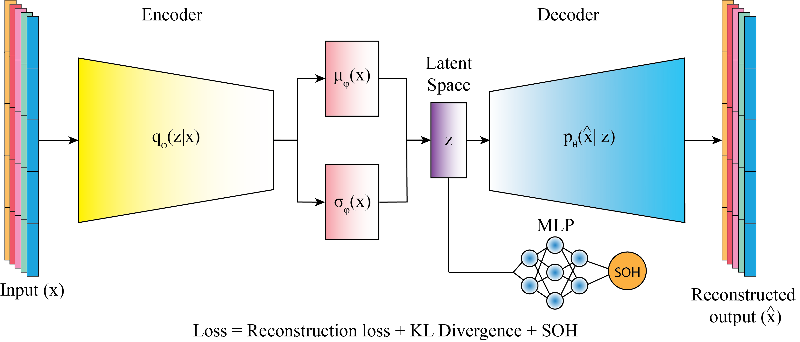
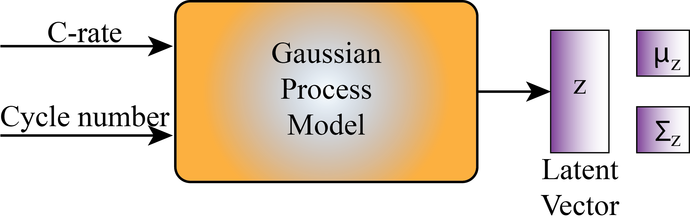

# BattVAE-GP: Battery Degradation Surrogate Modeling

This repository implements a hybrid deep generative and probabilistic learning pipeline for long-horizon lithium-ion battery degradation modeling. The workflow starts from PyBaMM-generated DFN/P2D simulations for NMC811 cells, learns a compact degradation-aware latent representation with a Variational Autoencoder (VAE), and then fits Gaussian Process (GP) models over the latent space to infer unseen operating conditions such as charging C-rate and cycle number.

The project is associated with the arXiv preprint:

> Raghvender Raghvender, Mahdi Abid, Ferran Brosa Planella, Charles Delacourt, and Arnaud Demortiere. **BattVAE-GP: Generative Modeling of Long-Horizon Battery Degradation with Uncertainty Quantification.** arXiv preprint arXiv:2607.11943, 2026. https://arxiv.org/abs/2607.11943

## Problem Setting

Physics-based battery degradation simulations are valuable but expensive to run densely across operating protocols. In this project, PyBaMM is used to simulate NMC811 degradation trajectories across charging rates of 0.2C, 0.3C, 0.5C, 0.6C, 0.75C, 0.85C, and 1.0C, while the discharge rate is fixed at 1C. Each charging condition contains 5000 simulated cycles generated with the Doyle-Fuller-Newman model.

The learned surrogate is designed to answer:

- How can full battery cycling trajectories be represented in a low-dimensional, structured latent space?
- Can the latent space encode both cycle progression and charging protocol?
- Can a GP learn this latent manifold and interpolate degradation trajectories at unseen C-rates?
- Can decoded latent predictions recover physically meaningful voltage-capacity and SOH behavior?

## Technical Approach

The pipeline has four main stages:

1. **Simulation data preparation**
   Raw PyBaMM cycle data are loaded from `data/raw/*.csv` and configured through `configs/datasets.yaml`. Each dataset includes charging rate, discharge rate, temperature, cycle range, and file path metadata.

2. **Capacity-aligned feature construction**
   The VAE preprocessing stack converts time-domain cycles into capacity-grid features. The current feature tensor contains 12 channels, including normalized capacity coordinates, charge/discharge voltage curves, voltage derivatives, inverse derivatives, hysteresis, and masks.

3. **Degradation-aware VAE training**
   The VAE uses a transformer encoder, Fourier coordinate features, a baseline-plus-residual decoder, and a small MLP head on the latent representation for SOH/degradation awareness. The default latent dimension is 2, which makes the learned manifold directly inspectable.

4. **Sparse GP latent modeling**
   The GP stage trains a sparse multitask GP over `(Cycle, c_rate) -> (z1, z2)`. The configured model uses protocol-level holdout evaluation, posterior uncertainty, deployment-model export, and interpolation for unseen C-rates such as 0.55C and 0.70C.

## Architecture Figures

Architecture diagrams are stored in `resources/` using these filenames:

- `VAE.png`: VAE encoder, latent space, decoder, and degradation-aware SOH head.
- `gp_model.png`: GP latent surrogate from `(Cycle, c_rate)` inputs to `(z1, z2)` posterior predictions and decoder-based reconstruction.



<p align="center">
  <strong style="font-size: 28px;">VAE architecture</strong>
</p>

<p align="center">
  <span>━━━━━━━━━━━━━━━━━━━━</span>
</p>

<p align="center">
  
</p>

<p align="center">
  <strong style="font-size: 28px;">GP architecture</strong>
  </p>


## Repository Layout

```text
.
|-- main.py                         # Unified VAE/GP entry point
|-- run.sh                          # End-to-end detached experiment runner
|-- plot_all_latent_spaces.py       # Overlay plot for learned and GP-interpolated latent spaces
|-- configs/
|   |-- vae.yaml                    # VAE architecture, training, and normalization config
|   |-- gp.yaml                     # GP model, holdout, and interpolation config
|   |-- datasets.yaml               # Raw data and latent-space dataset registry
|   `-- paths.yaml                  # Shared artifact paths
|-- resources/                     # VAE and GP architecture diagrams
|-- data/
|   |-- raw/                        # PyBaMM simulation CSVs
|   `-- processed/                  # Processed/intermediate outputs
|-- artifacts/
|   |-- saved_models/               # VAE checkpoints
|   |-- latent_space_data*/         # Per-C-rate VAE latent CSV/PTH outputs
|   |-- gp_outputs/                 # GP summaries, models, histories, predictions
|   |-- gp_interpolation/           # GP-predicted latent trajectories
|   `-- visualizations*/            # Diagnostic and publication-oriented plots
`-- src/
    |-- vae/                        # VAE models, training, inference, preprocessing, analysis
    |-- gp/                         # GP data loading, training, inference, analysis
    `-- common/                     # Config, logging, interpolation, and utility code
```

## Installation

Use Python 3.10 or newer. The code uses modern type syntax and Pydantic v2.

```bash
python -m venv .venv
source .venv/bin/activate
python -m pip install --upgrade pip
pip install -r requirements.txt
```

For GPU training, install the PyTorch build that matches your CUDA driver before or after installing the remaining requirements. See the official PyTorch install selector for the correct command for your system.

Build the containerized environment:

```bash
docker build -t battvae-gp:latest .
docker run --rm -it -v "$PWD:/workspace" battvae-gp:latest
```

## Quick Start

Run the full pipeline:

```bash
bash run.sh
```

`run.sh` starts a detached process, writes launcher logs under `run_history/launcher_<timestamp>/`, and writes training/inference logs under `run_history/train_<timestamp>/`. The script currently activates `../VAE/.venv`; update that path if your environment is located elsewhere.

Run individual stages:

```bash
python main.py --model vae --config configs/vae.yaml --run train
for dataset in data1 data2 data3 data4 data5 data6 data7; do
  python main.py --model vae --config configs/vae.yaml --dataset "$dataset" --run inference
done
python main.py --model gp --config configs/gp.yaml --run train
python main.py --model gp --config configs/gp.yaml --run interpolation
python main.py --model vae --config configs/vae.yaml --run interpolation
```

Plot all learned latent trajectories and GP interpolation outputs:

```bash
python plot_all_latent_spaces.py --gp-data all
```

## Reproducible Workflow

1. Download the raw PyBaMM CSV files from the data archive listed in `DATA_AVAILABILITY.md` and place them under `data/raw/` with the filenames registered in `configs/datasets.yaml`.

2. Run the complete VAE/GP workflow with `bash run.sh`. This trains the VAE, extracts latent spaces for the configured C-rates, trains the GP, performs interpolation at unseen C-rates, plots latent-space overlays, and decodes GP-predicted latent trajectories through the frozen VAE decoder.

3. For manual execution, use the stage-by-stage commands in the Quick Start section. Run VAE inference for each known C-rate dataset (`data1` through `data7`) before GP training when not using `run.sh`.

## Default Experiment Configuration

The default VAE configuration trains on `data1`, `data2`, `data3`, `data4`, `data5`, and `data7`, with `data6` held out for validation. These correspond to 1.0C, 0.75C, 0.5C, 0.3C, 0.2C, 0.85C, and 0.6C respectively.

The default GP configuration uses:

- Inputs: `Cycle`, `c_rate`
- Targets: `z1`, `z2`
- Model: sparse multitask GP (`sparse_gp_2d`)
- Kernel: RBF
- Inducing points: 256
- Holdout datasets: `data6` and `data2`
- Interpolation datasets: `data8` at 0.70C and `data9` at 0.55C

## Key Outputs

Important generated artifacts include:

- `artifacts/saved_models/best_model.pth`: trained VAE checkpoint with normalization statistics.
- `artifacts/latent_space_data*/latent_space.csv`: cycle-resolved latent coordinates for each known C-rate.
- `artifacts/gp_outputs/summary.csv`: protocol-level GP holdout metrics.
- `artifacts/gp_outputs/deployment_models.csv`: saved GP deployment model registry.
- `artifacts/gp_interpolation/latent_space_*.csv`: GP-inferred latent trajectories for unseen C-rates.
- `artifacts/vae_interpolation/`: decoded voltage/SOH outputs from GP-predicted latent points.
- `artifacts/latent_spaces_overlay.png`: consolidated latent-space visualization.

## Availability

Code and data availability are documented separately for manuscript review and archival release:

- `CODE_AVAILABILITY.md`: public repository, archived release DOI, license, and code scope.
- `DATA_AVAILABILITY.md`: data archive DOI, license, required CSV filenames, and generated artifact policy.
- `CITATION.cff`: machine-readable citation metadata for GitHub and archive platforms.
- `Dockerfile` and `.dockerignore`: containerized CPU-first execution environment.
- `configs/README.md`: explanation of the experiment configuration files.

## Citation

If you use this code or build on the method, cite:

```bibtex
@misc{raghvender2026battvaegp,
  title        = {BattVAE-GP: Generative Modeling of Long-Horizon Battery Degradation with Uncertainty Quantification},
  author       = {Raghvender, Raghvender and Abid, Mahdi and Brosa Planella, Ferran and Delacourt, Charles and Demortiere, Arnaud},
  year         = {2026},
  eprint       = {2607.11943},
  archivePrefix = {arXiv},
  primaryClass = {cs.LG},
  note         = {arXiv preprint arXiv:2607.11943}
}
```

## Engineering Notes

This repository is structured as a research-grade ML pipeline rather than a single notebook. It uses typed configuration schemas, reusable VAE and GP modules, deterministic seeds, explicit artifact directories, protocol-level holdout evaluation, uncertainty-aware predictions, and publication-oriented analysis scripts. The separation between simulation data, representation learning, probabilistic interpolation, and decoding makes it straightforward to extend the framework to additional C-rates, temperatures, chemistries, or experimental datasets.
